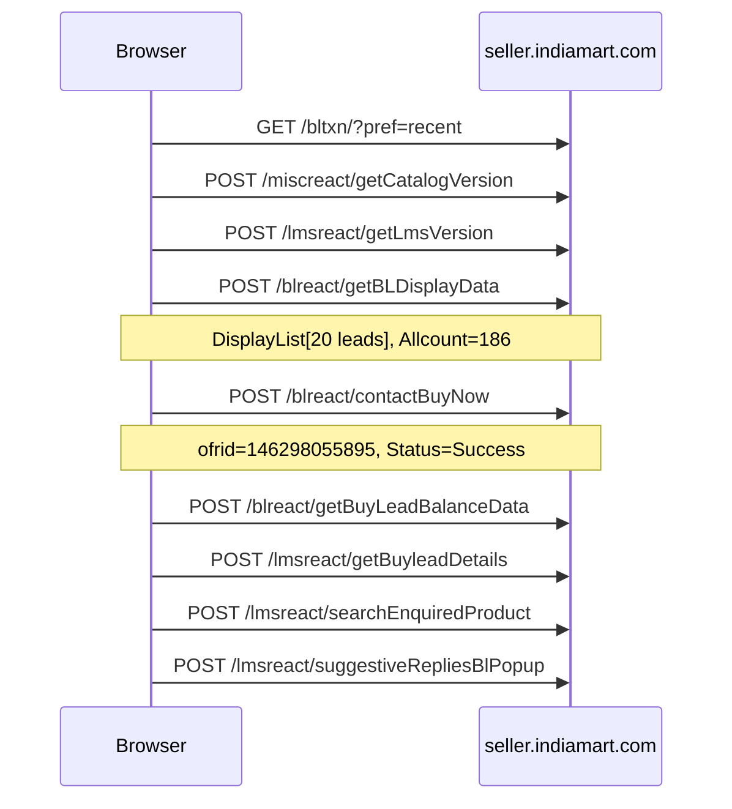
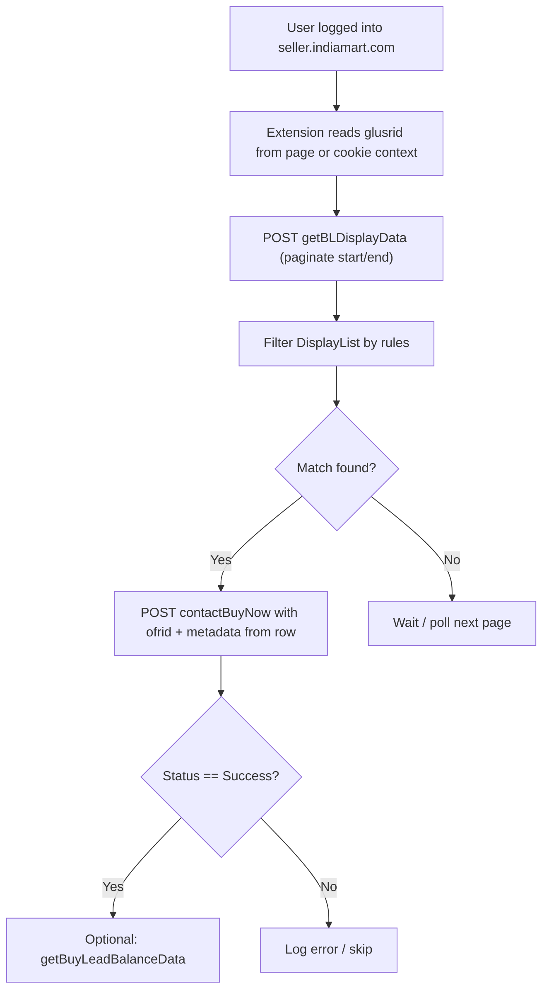

# IndiaMart Buy Leads HAR Analysis

## Captured user flow


| Step | Time (UTC)  | Action                                                              |
| ---- | ----------- | ------------------------------------------------------------------- |
| 1    | 07:51:22    | Page load: `https://seller.indiamart.com/bltxn/?pref=recent`        |
| 2    | 07:51:24    | Supporting version checks                                           |
| 3    | 07:51:25    | **Lead list fetched** (`getBLDisplayData`) — 186 total, 20 returned |
| 4    | 07:51:37    | **Buy Lead clicked** (`contactBuyNow`) — lead `146298055895`        |
| 5    | 07:51:37–38 | Post-purchase UI calls (balance refresh, popup, suggested replies)  |





---

## 1. Lead loading API (primary)

### Endpoint

- **URL:** `POST https://seller.indiamart.com/blreact/getBLDisplayData`
- **Content-Type:** `application/json`
- **Auth headers in HAR:** none (`Authorization` absent; `Cookie` header absent — see Session section)
- **Other headers:** standard browser CORS headers (`Origin`, `Referer: https://seller.indiamart.com/bltxn/?pref=recent`, `User-Agent`)

### Request payload (from HAR)

```json
{
  "LocPref": "4",
  "stateid": "",
  "city": "",
  "iso": "",
  "pref_city_lead": 0,
  "glusrid": "56238099",
  "inbox": "",
  "offer": "",
  "offer_type": "B",
  "start": 1,
  "end": 20,
  "UsageTyp": "",
  "quantity": "",
  "is_email": "",
  "is_gst": "",
  "is_catalog": "",
  "is_mobnum": "",
  "is_busname": "",
  "mcatid": "",
  "sov": "",
  "eov": null,
  "enqType": ""
}
```

**Parameter notes:**


| Field                                                         | Value in capture  | Purpose                                            |
| ------------------------------------------------------------- | ----------------- | -------------------------------------------------- |
| `glusrid`                                                     | Seller GL user ID | Identifies logged-in seller                        |
| `offer_type`                                                  | `"B"`             | Buy-leads tab (vs other offer types)               |
| `LocPref`                                                     | `"4"`             | Location filter; response echoes `LocPref: "CITY"` |
| `start` / `end`                                               | `1` / `20`        | Pagination (20 leads per page)                     |
| `mcatid`, `city`, `stateid`, `iso`                            | empty             | Category/location filters (optional)               |
| `sov`, `eov`                                                  | empty / null      | Order-value filters (optional)                     |
| `is_email`, `is_gst`, `is_catalog`, `is_mobnum`, `is_busname` | empty             | Buyer verification filters                         |


### Response structure (HTTP 200)

Top-level keys:

`Allcount`, `BLflag`, `BLmsg`, `CODE`, `Categories`, `CategoryName`, `DisplayList`, `Lead_Count`, `LocPref`, `Msg`, `MESSAGE`, `STATUS`, `TotalBuylead`, `StateWiseCount`, `cities`, `countries`, `unique_id`, …

**Success indicators:** `CODE: "200"`, `BLflag: "1"`, `STATUS: "Success"`, `Msg: "Success"`

**Summary counts in this capture:**

- `Allcount`: `"186"` (total matching leads)
- `Lead_Count`: `20` (returned in this page)
- `TotalBuylead`: `179`

### Lead array: `DisplayList`

Each lead object contains **90+ fields**. Key fields for filtering and purchase mapping:


| Filter / use case         | JSON field                                    | Example (lead #1)                      |
| ------------------------- | --------------------------------------------- | -------------------------------------- |
| **Lead ID (purchase)**    | `ETO_OFR_ID`                                  | `146298055895`                         |
| Alt display ID            | `BLCARDDATA[0].FK_ETO_OFR_DISPLAY_ID`         | `146298055895`                         |
| **Title**                 | `ETO_OFR_TITLE`                               | `"Kids Unicorn Polyester Trolley Bag"` |
| **Credit cost ("price")** | `ETO_CREDITS`                                 | `200`                                  |
| **City**                  | `GLUSR_CITY`                                  | `"Bengaluru"`                          |
| **State**                 | `GLUSR_STATE`                                 | `"Karnataka"`                          |
| **Country**               | `GLUSR_COUNTRY`                               | `"India"`                              |
| **Category ID**           | `FK_GLCAT_MCAT_ID`                            | `96454`                                |
| **Category name**         | `ETO_OFR_GLCAT_MCAT_NAME` / `PRIME_MCAT_NAME` | `"Kids School Bag"`                    |
| **Order value**           | `ETO_OFR_APPROX_ORDER_VALUE`                  | `"Above 3,000"`                        |
| **Quantity**              | `ETO_OFR_QTY`                                 | (may be blank)                         |
| **Purchase state**        | `PURCHASE_STATUS`                             | `"OPEN"`                               |
| **Grid metadata**         | `GRID_PARAMETERS`                             | `"1#3 3#1#BA#4"`                       |
| Verified buyer flags      | `ETO_OFR_VERIFIED`, `ETO_OFR_EMAIL_VERIFIED`  | various ints                           |
| Attachments               | `ATTACHMENT`, `IS_ATTACHMENT`                 | image URLs                             |


**Sample first 5 leads (credits were all 200 in this page):**

1. Bengaluru / Kids School Bag / Above 3,000
2. Kochi / Diaper Bags / Above 1,000
3. Pudukkottai / Bags
4. Kolar / College Bag
5. Virudhunagar / School Bags

**Category facet object:** `Categories` maps mcat ID → `[count, name, type]` e.g. `"96454": ["1", "Kids School Bag", "B"]`

---

## 2. Lead purchase API (primary)

### Endpoint

- **URL:** `POST https://seller.indiamart.com/blreact/contactBuyNow`
- **Content-Type:** `application/json`
- **Triggered by:** Buy Lead button click (initiator: BuyLead React bundle)

### Request payload (from HAR)

```json
{
  "glusrId": "56238099",
  "ofrid": "146298055895",
  "purchasemod": "WEB",
  "count": 1,
  "tsearch_text": "all_buyleads",
  "serial": 1,
  "responseTextArea": 0,
  "bl_page_location": "page=recent#city=#mcatid=#locpref=",
  "matched_mcat_id": "96454",
  "order_value_flag": "",
  "is_bulk_order": "",
  "ofrtitle": "Kids Unicorn Polyester Trolley Bag",
  "mapped_mcat_id": "96454",
  "GRID_PARAMETERS": "1#3 3#1#BA#4",
  "ptime": "20-06-2026 01:21:37",
  "pref": "https://seller.indiamart.com/bltxn/?pref=recent",
  "grid_lead_pos": 1,
  "NIClick": 1
}
```

### How the lead is identified

- **Primary identifier:** `ofrid` in the JSON body (= `ETO_OFR_ID` from `DisplayList`)
- Not in URL path; not a Bearer token
- Supporting fields copied from the listing row: `ofrtitle`, `matched_mcat_id`, `mapped_mcat_id`, `GRID_PARAMETERS`, `grid_lead_pos`

### Response (HTTP 200 — success)

Top-level keys: `AttachmentInfo`, `BuyLead`, `Data`, `Flag`, `Status`, `pur_id`, `unique_id`, `RESPONSE_TIME`, `issue_rectify`

**Success indicators:**

- `Status`: `"Success"`
- `Flag`: `1`
- `BuyLead`: `"B"`
- `pur_id`: purchase record ID (e.g. `1264237015`)

**Buyer contact data** arrives in `Data[0]` (only after successful purchase):

- `GLUSR_USR_PH_MOBILE`, `GLUSR_USR_EMAIL`, `GLUSR_NAME`, `GLUSR_CITY`, `GLUSR_STATE`, `ETO_OFR_TITLE`, `ETO_OFR_ID`, etc.

---

## 3. Supporting APIs

### Required for listing/purchase core loop


| Endpoint                              | When           | Body                                                                               | Notes                                             |
| ------------------------------------- | -------------- | ---------------------------------------------------------------------------------- | ------------------------------------------------- |
| `POST /miscreact/getCatalogVersion`   | Page init      | `{}`                                                                               | Returns `{"version":46}`                          |
| `POST /lmsreact/getLmsVersion`        | Page init      | `{}`                                                                               | Returns `{"version":1734}`                        |
| `POST /blreact/getBuyLeadBalanceData` | After purchase | `{"glusrid":"…","token":"imobile@15061981","modid":"MY","bl_credits_curweek":"1"}` | Credit balance refresh; `glusr_credits_av: 11800` |


### Post-purchase UI only (not required to complete purchase)


| Endpoint                                       | Body                                       | Purpose                     |
| ---------------------------------------------- | ------------------------------------------ | --------------------------- |
| `POST /lmsreact/getWhatsappIntegrationDetails` | `{}`                                       | WhatsApp integration status |
| `POST /lmsreact/getUserDetailfromGlid`         | (empty body)                               | Seller profile for popup    |
| `POST /lmsreact/getBuyleadDetails`             | `{"glid":95636907,"offerId":146298055895}` | Buyer + attachment details  |
| `POST /lmsreact/searchEnquiredProduct`         | product search for reply templates         | Catalog product suggestions |
| `POST /lmsreact/suggestiveRepliesBlPopup`      | buyer/seller glids + price/qty             | Auto-reply popup content    |


---

## 4. Session and authentication

### What the HAR shows

- **No `Authorization` header** on any request
- **No `Cookie` header** on any request (HAR export did not include cookies)
- **No `Set-Cookie`** in any response in this file

### Likely auth model

IndiaMart seller session is almost certainly **HTTP cookie-based** (standard logged-in browser session). The APIs work as same-origin XHR with implicit cookies — which is why the HAR works in-browser but shows empty `cookies: []`.

### Static app token (not session)

`getBuyLeadBalanceData` sends `"token": "imobile@15061981"` — this is a **hardcoded client/mod identifier**, not a per-user JWT. Do not treat it as a refreshable session token.

### How the extension should capture auth

1. **Preferred:** Run `fetch()` from a content script or offscreen document on `seller.indiamart.com` with `credentials: 'include'` — reuses live session automatically.
2. **Alternative:** `chrome.cookies.getAll({ domain: '.indiamart.com' })` in a background service worker (requires `cookies` + host permissions).
3. **Extract `glusrid`:** From API payloads, page JS (`uid=56238099` in analytics), or seller profile responses.

### Expiration

- Session cookies typically expire on logout / timeout (exact TTL not visible in this HAR).
- Re-export HAR with **"Include cookies"** checked if you need to inspect cookie names (likely session identifiers on `.indiamart.com`).
- The extension should detect `401/403` or `CODE != 200` and prompt re-login.

---

## 5. Recommended extension API sequence




**Minimum viable purchase call:** `getBLDisplayData` → filter → `contactBuyNow`

---

## 6. Technical risks and prerequisites


| Risk                       | Detail                                                                  | Mitigation                                                                                             |
| -------------------------- | ----------------------------------------------------------------------- | ------------------------------------------------------------------------------------------------------ |
| **Missing cookies in HAR** | Cannot replay APIs outside browser without session                      | Extension must operate in authenticated tab context                                                    |
| **CORS**                   | Blocks third-party origins                                              | Extension with `host_permissions: ["*://seller.indiamart.com/*"]` bypasses CORS for programmatic calls |
| **Race conditions**        | Leads can be bought by others first                                     | Check `PURCHASE_STATUS: "OPEN"`; handle non-success responses; expect fast polling competition         |
| **Credit balance**         | Each lead costs `ETO_CREDITS` (200 in sample)                           | Pre-check via `getBuyLeadBalanceData`; account had 11,800 credits                                      |
| **Server validation**      | `GRID_PARAMETERS`, `ptime`, `grid_lead_pos`, `NIClick` may be validated | Copy exactly from `DisplayList` row; use current timestamp for `ptime`                                 |
| **Rate limiting**          | Not observed; aggressive polling may trigger blocks                     | Use reasonable intervals (e.g. 2–5s); backoff on errors                                                |
| **Terms of service**       | Automated lead purchasing may violate IndiaMart policies                | Review seller TOS; automation could risk account suspension                                            |
| **PII in responses**       | Purchase response exposes buyer phone/email                             | Handle securely; do not log to third parties                                                           |
| **API drift**              | Version endpoints suggest frequent deploys                              | Monitor `getCatalogVersion` / `getLmsVersion`; be ready to update payloads                             |
| **Anti-bot**               | Analytics (GTM, Clarity, Yandex) present; no CAPTCHA in this flow       | Unlikely on API alone, but could appear under abuse                                                    |


### Prerequisites before coding

1. Active **paid IndiaMart seller account** with buy-lead credits
2. User **logged in** on `seller.indiamart.com` in Chrome
3. Extension manifest permissions: `seller.indiamart.com`, optionally `cookies`, `storage`
4. Filter criteria defined (city, mcat, max credits, order value, etc.)
5. Re-capture HAR with cookies enabled if standalone API testing is needed outside the extension

---

## 7. Suggested extension architecture (next step after approval)

The repo currently contains only the HAR file — no extension code yet.

Proposed structure:

- `[manifest.json](manifest.json)` — MV3, content script on `/bltxn/`*
- `content.js` — poll `getBLDisplayData`, apply filters, call `contactBuyNow`
- `background.js` — optional cookie/session helpers, logging
- `popup.html` — start/stop automation, filter config

**Core implementation pattern:**

```javascript
// Run in content script on seller.indiamart.com
const res = await fetch('/blreact/getBLDisplayData', {
  method: 'POST',
  credentials: 'include',
  headers: { 'Content-Type': 'application/json' },
  body: JSON.stringify({ glusrid, offer_type: 'B', start: 1, end: 20, LocPref: '4', /* filters */ })
});
const leads = (await res.json()).DisplayList;
// filter leads, then:
await fetch('/blreact/contactBuyNow', {
  method: 'POST',
  credentials: 'include',
  headers: { 'Content-Type': 'application/json' },
  body: JSON.stringify({ glusrId, ofrid: lead.ETO_OFR_ID, /* copy GRID_PARAMETERS, ofrtitle, etc. */ })
});
```

---

## Security note

The HAR contains real buyer PII (email, phone) in `contactBuyNow` responses. Do not commit it to public repos; redact before sharing.