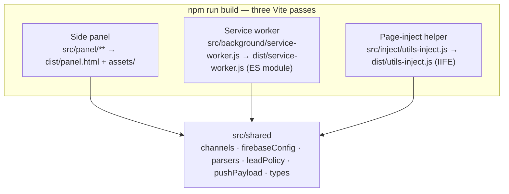
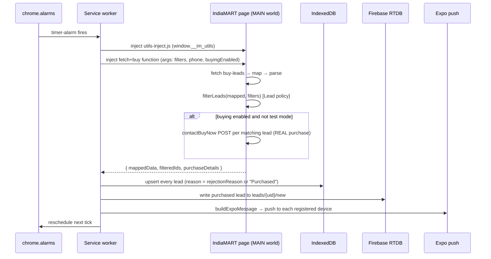

# Architecture — IndiaMART Lead Notifier (extension)

This document explains how the extension is put together: the three execution contexts, the shared
seam that keeps them in sync, the message contract between them, the storage layers, and the
end-to-end lead cycle. If you're new here, read the [README](../README.md) first for setup, then
this for the "why".

---

## Three execution contexts, one build

An MV3 extension runs code in separate worlds that can't call each other directly. This extension
has three, and **all three are built by Vite** so they can share typed modules from `src/shared`:

- **Side panel** (`src/panel`) — the React UI. A standard Vite app build (`vite.config.mjs`).
- **Service worker** (`src/background`) — the background engine: timer, alarms, script injection,
  IndexedDB, Firebase writes, Expo push. Built as a **single self-contained ES module**
  (`vite.worker.config.mjs`) because the manifest declares `"type": "module"`.
- **Page-inject helper** (`src/inject`) — parsers + the lead filter, injected into the IndiaMART
  page's `MAIN` world. Built as a **self-executing IIFE** (`vite.inject.config.mjs`) because it's
  injected as a classic script (no runtime ESM) and attaches itself to `window.__im_utils`.

> Historically the worker and helper lived in `public/*.js` as untyped copies, and shared values
> (channel IDs, Firebase config, filter rules) were hand-duplicated across them. Bundling all three
> through Vite let them import one `src/shared` seam instead. See
> [ADR-0002](adr/0002-build-worker-and-inject-via-vite.md) and
> [ADR-0001](adr/0001-dedupe-within-repo.md).

---

## The shared seam (`src/shared`)

Single source of truth consumed by every context:

| Module | Responsibility | Consumed by |
|---|---|---|
| `channels.ts` | Android notification channel IDs | worker, panel (via payload) |
| `firebaseConfig.ts` | Firebase web config | panel (SDK), worker (RTDB REST URL) |
| `parsers.ts` | Parse raw lead fields (price, time, quantity) | inject helper |
| `leadPolicy.ts` | **The Lead acceptance policy** — `evaluateLead` → `filterLeads` / `rejectionReason` | inject (filter), worker (reasons) |
| `pushPayload.ts` | `buildExpoMessage` — the Expo push shape | worker (prod), panel (test button) |
| `types.ts` | `LeadFilters`, `EvaluableLead` | all |

The **Lead policy** is the important one: filtering (in the injected helper) and rejection-reason
text (in the worker, for the CSV) are both derived from one `evaluateLead`, so they can never
disagree.

---

## Message contract (panel ↔ worker)

The panel talks to the worker with `chrome.runtime.sendMessage`. Four message types:

| Type | Direction | Payload | Response |
|---|---|---|---|
| `START_TIMER` | panel → worker | `{ tabId, url, seconds, filters, phoneNumber, testMode }` | `{ ok, nextFireTime, cycleCount }` |
| `STOP_TIMER` | panel → worker | `{ tabId, url }` | `{ ok }` |
| `GET_TIMER_STATE` | panel → worker | — | `{ running, seconds, tabId, url, nextFireTime, cycleCount }` |
| `GET_ALL_LEADS` | panel → worker | — | `{ leads }` (from IndexedDB) |

The panel polls `GET_TIMER_STATE` once a second (`useTimer`) to render the live countdown — the
worker holds the authoritative timer state, not the panel.

---

## Storage layers

Four independent stores, each with a distinct job (there is deliberately no unifying abstraction):

| Store | Owner | Holds |
|---|---|---|
| `localStorage` (`im-extension-settings`) | panel (`useSettings`) | the user's filter/timer settings |
| `chrome.storage.local` | panel ↔ worker | `registeredDevices`, `googleUID`, `googleIdToken` |
| **IndexedDB** (`indiamart_leads`) | worker | every seen lead + reason + filter snapshot (CSV source) |
| **Firebase RTDB** | both | `leads/{uid}/new` (out-of-band push channel), `devices/{uid}` (read by panel) |

---

## The lead cycle (end to end)

What happens on each timer tick:

The injected fetch/buy function runs in the page's `MAIN` world (so it inherits the seller's
session cookies). It is **serialized and injected**, so it can only use its arguments and page
globals (`window.__im_utils`, `fetchGlidScriptJSFile`) — it cannot import from the bundle.

> **Known issue (documented, not fixed):** in the injected function `purchaseDetails` is declared
> inside the `if (enableLeadBuying)` block but read in the outer return via a `typeof` guard, so it
> is always `[]`. As a result the Expo push with buyer details is not currently sent from the
> purchase path. Fixing it is a one-line hoist — tracked as a deliberate follow-up.

---

## Panel composition

`DashboardPage` is thin — it composes three hooks and two pure helpers:

- `useSettings` — loads/saves settings (localStorage) and builds the `START_TIMER` payload.
- `useTimer` — polls `GET_TIMER_STATE`; exposes `start`/`stop`/`reset`.
- `useDevices` — subscribes to `devices/{uid}` in RTDB, mirrors the token list into `chrome.storage`.
- `lib/leadsCsv.ts` — pure `leadsToCsv(leads)`.
- `lib/testNotification.ts` — fires a mock push via the shared `buildExpoMessage`.

---

## Cross-repo wire contract

The extension and the [mobile app](https://github.com/Nadhim002/lead-notifier-mobile) are separate
repos sharing three formats **by convention, not shared code** (see
[ADR-0003](adr/0003-cross-repo-contract-documented.md)):

1. **Channel IDs** (`src/shared/channels.ts` ↔ mobile `channels.ts`) — a mismatch makes Android
   silently drop the notification.
2. **Firebase project** — both point at the same RTDB. The extension **writes** `leads/{uid}/new`
   and **reads** `devices/{uid}`; the phone **writes** its `devices/{uid}/{deviceId}` record and
   **reads** `leads/{uid}/new`.
3. **Expo push payload** (`src/shared/pushPayload.ts`) — the shape the phone must understand
   (`phonecall` = data-only full-screen intent; otherwise a banner notification).

Change any of these and you must update both repos together.
